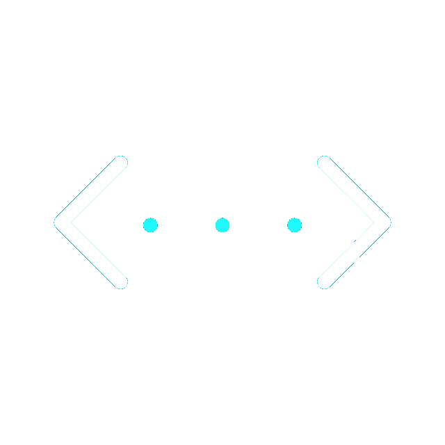
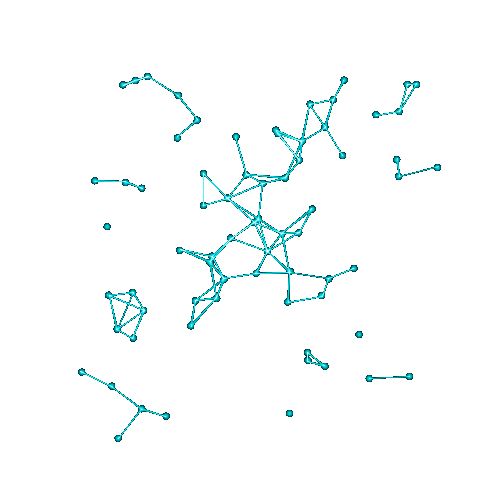

<h1 align="center">

</h1>

  <h3>About Me</h3>
  

  I'm Joe
   
  A meticulous developer
   
  obsessed with coding, who likes reading and creativity.

---

  <h3> My Hommies</h3>
  

  <code></code>
  <code></code>
  <code></code>
  <code></code>
  <code></code>
  <code></code>
  <code></code>
  <code></code>
  <code></code>
  <code></code>
  <code></code>
  <code></code>
  <code></code>
  <code></code>
  <code></code>
  <code></code>
  <code></code>
  <code></code>
  <code></code>
  <code></code>
  <code></code>
  <code></code>

---

  <h3>Stats</h3>

  
   
  
  
  

  

   </img>

